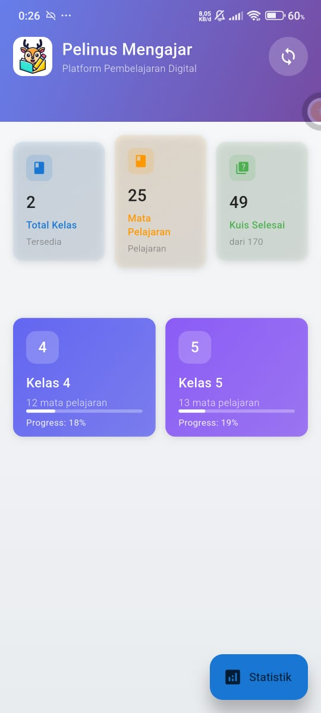
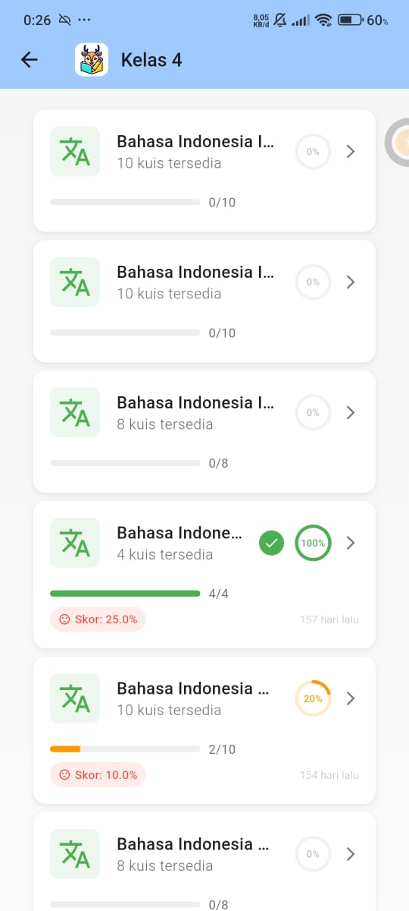
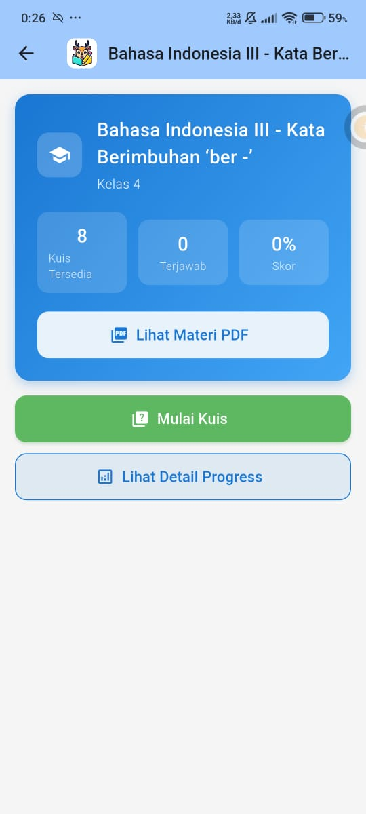
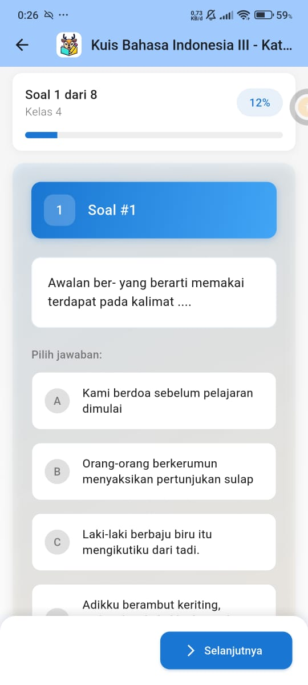
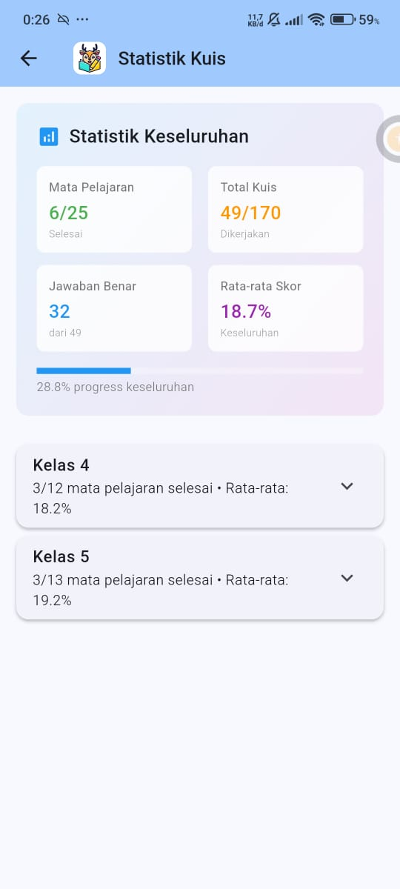

# 📱 Pelinus Siswa - Mobile App

<p align="center">
  
</p>

<p align="center">
  
  
  
  
  
</p>

<p align="center">
  <b>Platform Pembelajaran Digital untuk Siswa Pelinus Mengajar</b>
</p>

## 📖 Deskripsi

**Pelinus Siswa** adalah aplikasi mobile cross-platform yang dibangun menggunakan **Flutter** untuk para siswa dalam program **Pelinus Mengajar**. Aplikasi ini memungkinkan siswa untuk mengakses materi pembelajaran, melihat PDF, mengerjakan kuis, dan belajar secara offline.

## 🔗 Related Repository

| Repository | Deskripsi |
|------------|-----------|
| [pelinus](https://github.com/farreladriann/pelinus) | Backend API (Express.js + TypeScript) |

## 📱 Screenshots

<p align="center">
  
  
  
  
</p>

<p align="center">
  
  
</p>

### 🖼️ Penjelasan Screenshots

| Screenshot | Halaman | Deskripsi |
|------------|---------|-----------|
| **Home** | Dashboard | Ringkasan total kelas, mata pelajaran, kuis selesai, dan progress per kelas |
| **Subjects** | Mata Pelajaran | Daftar mata pelajaran dengan progress tracking dan skor |
| **Detail** | Detail Materi | Akses materi PDF, mulai kuis, dan lihat detail progress |
| **Quiz** | Kuis | Interface mengerjakan kuis |
| **Stats** | Statistik | Statistik keseluruhan:  mata pelajaran selesai, total kuis, jawaban benar, rata-rata skor |
| **Detail Progress** | Progress | Detail progress pembelajaran per kelas |

## ✨ Fitur Utama

- 📚 **Akses Materi Pembelajaran** - Baca materi dalam format PDF
- 📝 **Sistem Kuis** - Kerjakan kuis untuk menguji pemahaman
- 📊 **Tracking Progress** - Pantau progress belajar per mata pelajaran
- 📈 **Statistik Lengkap** - Lihat statistik keseluruhan pencapaian
- 📶 **Offline Mode** - Belajar tanpa koneksi internet
- 🔄 **Sinkronisasi Otomatis** - Data tersinkron saat online
- 📱 **Cross-platform** - Tersedia untuk Android & iOS

## 🛠️ Tech Stack

| Teknologi | Kegunaan |
|-----------|----------|
| **Flutter** | Cross-platform framework |
| **Dart** | Programming language |
| **Riverpod** | State management |
| **Dio** | HTTP client untuk API calls |
| **SQLite (sqflite)** | Local database untuk offline mode |
| **flutter_pdfview** | Menampilkan file PDF |
| **connectivity_plus** | Deteksi status koneksi internet |
| **permission_handler** | Manajemen permissions |

## 🏗️ Arsitektur

Aplikasi ini menggunakan **Clean Architecture** dengan struktur: 

```
lib/
├── core/           # Utilities, constants, themes
├── data/           # Data sources, repositories implementation
│   ├── datasources/
│   ├── models/
│   └── repositories/
├── domain/         # Business logic layer
│   ├── entities/
│   ├── repositories/
│   └── usecases/
├── presentation/   # UI layer
│   ├── pages/
│   ├── widgets/
│   └── providers/
└── main.dart       # Entry point
```

## 🚀 Cara Menjalankan

### Prerequisites
- Flutter SDK v3.0.0+
- Dart SDK v3.0.0+
- Android Studio / VS Code
- Android SDK / Xcode (untuk iOS)

### Instalasi

```bash
# Clone repository
git clone https://github.com/farreladriann/pelinus_siswa.git
cd pelinus_siswa

# Install dependencies
flutter pub get

# Generate JSON serialization code
flutter pub run build_runner build

# Jalankan aplikasi
flutter run
```

### Build APK/IPA

```bash
# Build APK (Android)
flutter build apk --release

# Build App Bundle (Android)
flutter build appbundle --release

# Build IPA (iOS)
flutter build ios --release
```

## 📋 Dependencies Utama

```yaml
dependencies:
  flutter_riverpod: ^2.4.9    # State management
  dio: ^5.3.3                  # HTTP client
  sqflite: ^2.3.0              # Local database
  flutter_pdfview: ^1.3.2      # PDF viewer
  connectivity_plus: ^5.0.2    # Network connectivity
  permission_handler: ^11.1.0  # Permissions
  intl: ^0.19.0                # Internationalization
```

## 🔧 Konfigurasi

Pastikan untuk mengatur base URL API di konfigurasi aplikasi sesuai dengan backend: 

```
Backend URL: https://pelinus. vercel.app
```

## 👨‍💻 Author

**Farrel Adrian**
- GitHub: [@farreladriann](https://github.com/farreladriann)

---

<p align="center">
  ⭐ Jika project ini membantu, jangan lupa berikan star! 
</p>
